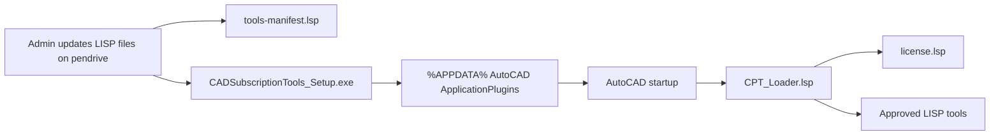

# Architecture

## Phase 1: Pendrive Installer



The installer copies the current pendrive payload into AutoCAD's per-user application plugin folder:

```text
%APPDATA%\Autodesk\ApplicationPlugins\CADSubscriptionTools.bundle
```

AutoCAD detects the `.bundle`, reads `PackageContents.xml`, and loads:

```text
Contents\CPT_Loader.lsp
```

The loader checks:

```text
%APPDATA%\CADSubscriptionTools\License\license.lsp
```

If the license status is active, the loader reads:

```text
Contents\Tools\tools-manifest.lsp
```

Then it loads the approved `.lsp` files listed in that manifest.

## Phase 2: Cloud Subscription Platform

Recommended production components:

- Customer website for signup, checkout, downloads, invoices, and license status.
- Admin portal for customers, subscriptions, devices, and tool versions.
- Licensing API for activation and periodic validation.
- Tool packaging service that encrypts or signs LISP bundles.
- Update client inside AutoCAD or a local Windows helper service.
- Audit logs for installs, activation attempts, and device changes.

## Device Locking

For a serious commercial product, do not rely only on AutoLISP for device locking. AutoLISP files can be opened and modified by advanced users.

Recommended secure path:

- Build a compiled .NET AutoCAD loader or Windows helper.
- Generate a device fingerprint from stable machine identifiers.
- Activate through the server.
- Store a signed token locally.
- Validate token signature before loading LISP tools.
- Download encrypted tool packages and decrypt only after validation.

## Offline vs Online

Pendrive mode:

- Good for demos, pilots, and controlled customer installs.
- Admin physically updates the USB payload.
- Customer must rerun installer to receive updated LISP files.

Online mode:

- Best for subscriptions.
- Customer installs once.
- Loader checks for updates automatically.
- Admin can add/remove tools centrally.
- Subscription expiry can disable access without visiting the customer machine.
